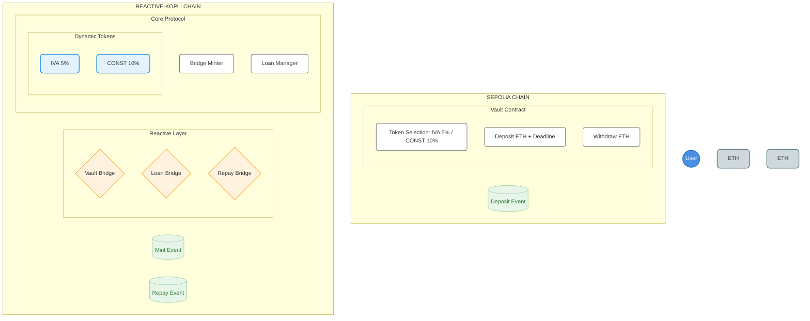

# Dynamic Price Token Lending Protocol

## Overview

This protocol implements a cross-chain lending system between Sepolia and Reactive-Kopli networks, featuring dynamic price tokens and automated loan management. The system allows users to:

- Deposit ETH on Sepolia and receive dynamic price tokens on Reactive-Kopli
- Manage loans with variable interest rates
- Repay loans cross-chain with automated settlement

## Architecture



## Smart Contracts

### Sepolia Network
- **Vault Contract**: Handles ETH deposits and withdrawals with token selection
  - Features: Token selection (IVA 5% / CONST 10%)
  - Deposit with deadline
  - Automated withdrawals

### Reactive-Kopli Network
- **Dynamic Price Tokens**: Two ERC20 tokens with different price dynamics
  - Customizable initial price, max supply, mint increase, and burn decrease
- **Bridge Minter**: Handles cross-chain token minting
- **Loan Manager**: Manages loan operations and repayments
- **Bridge Contracts**:
  - VaultBridge: Handles deposit events
  - LoanBridge: Manages loan operations
  - RepayBridge: Processes repayments

## Deployment Guide

### Prerequisites
- Environment Variables:
  - `SEPOLIA_RPC`
  - `SEPOLIA_PRIVATE_KEY`
  - `REACTIVE_RPC`
  - `REACTIVE_PRIVATE_KEY`
  - `SYSTEM_CONTRACT_ADDRESS`

### Step 1: Deploy Dynamic Price Tokens (Reactive-Kopli)

# Deploy first token (IVA 5%)
```bash
forge create --rpc-url $REACTIVE_RPC --private-key $REACTIVE_PRIVATE_KEY DynamicPriceToken.sol:DynamicPriceToken --constructor-args "IVA Token" "IVA" <initialPrice> <maxSupply> <mintIncrease> <burnDecrease>
```

# Deploy second token (CONST 10%)
```bash
forge create --rpc-url $REACTIVE_RPC --private-key $REACTIVE_PRIVATE_KEY DynamicPriceToken.sol:DynamicPriceToken --constructor-args "CONST Token" "CONST" <initialPrice> <maxSupply> <mintIncrease> <burnDecrease>
```

### Step 2: Deploy Vault (Sepolia)
```bash
forge create --rpc-url $SEPOLIA_RPC --private-key $SEPOLIA_PRIVATE_KEY Vault.sol:Vault --constructor-args <token1_address> 5 <token2_address> 10 $SYSTEM_CONTRACT_ADDRESS --value 0.1ether
```

### Step 3: Deploy Bridge Minter (Reactive-Kopli)
```bash
forge create --rpc-url $REACTIVE_RPC --private-key $REACTIVE_PRIVATE_KEY BridgeMinter.sol:BridgeMinter --constructor-args $SYSTEM_CONTRACT_ADDRESS --value 0.01ether
```

### Step 4: Deploy Bridge Contracts (Reactive-Kopli)
```bash
# VaultBridge
forge create --rpc-url $REACTIVE_RPC --private-key $REACTIVE_PRIVATE_KEY VaultBridge.sol:VaultBridge --constructor-args $SYSTEM_CONTRACT_ADDRESS <vault_address> <bridge_minter_address> 11155111 5318008

# Loan Manager
forge create --rpc-url $REACTIVE_RPC --private-key $REACTIVE_PRIVATE_KEY LoanManager.sol:LoanManager --constructor-args $SYSTEM_CONTRACT_ADDRESS --value 0.01ether

# LoanManagerBridge
forge create --rpc-url $REACTIVE_RPC --private-key $REACTIVE_PRIVATE_KEY LoanManagerBridge.sol:LoanManagerBridge --constructor-args $SYSTEM_CONTRACT_ADDRESS <bridge_minter_address> <loan_manager_address> 5318008 5318008

# RepayBridge
forge create --rpc-url $REACTIVE_RPC --private-key $REACTIVE_PRIVATE_KEY RepayBridge.sol:RepayBridge --constructor-args $SYSTEM_CONTRACT_ADDRESS <loan_manager_address> <vault_address> 5318008 11155111
```

## Usage Guide

### 1. Deposit ETH (Sepolia)
- Call `deposit` function on Vault contract:
```solidity
function deposit(address tokenSelected, uint256 timeduration) public payable
```
Example:
- Token Address: 0x4275E2A55D3330CBb5e58ec94f2d7D930bd6229C
- Duration: 3600 (60 minutes)
- Amount: 0.1 ETH

### 2. Manage Loan (Reactive-Kopli)
1. Check current repayment amount via LoanManager contract
2. Approve token spending
3. Execute repayment

### Example Transactions
- Sepolia Deposit: [0xa4e882f7f216c90cc43a1097df9e078f8e1219687b4acc396c08b2d73d844d65](https://sepolia.etherscan.io/tx/0xa4e882f7f216c90cc43a1097df9e078f8e1219687b4acc396c08b2d73d844d65)
- Kopli Bridge: [0x9d6326f28d4d500c17324734e012a59a231f6dd7d0c3e91d857ef23779ac9c8d](https://kopli.reactscan.net/tx/0x9d6326f28d4d500c17324734e012a59a231f6dd7d0c3e91d857ef23779ac9c8d)
- Token Approval: [0x7534d950167949322cda5c2dd164bada2728e85f052685a6ed946181e660b77d](https://kopli.reactscan.net/tx/0x7534d950167949322cda5c2dd164bada2728e85f052685a6ed946181e660b77d)
- Loan Repayment:
  - Kopli: [0x8da661149ff660b7fabc90a8044e0d82c63fed252021886542295ad0ec881707](https://kopli.reactscan.net/tx/0x8da661149ff660b7fabc90a8044e0d82c63fed252021886542295ad0ec881707)
  - Sepolia: [0xb97b3df7e39c72fba92b5ae8ce1596b4b707eb5070f365b01017837049b3075a](https://sepolia.etherscan.io/tx/0xb97b3df7e39c72fba92b5ae8ce1596b4b707eb5070f365b01017837049b3075a)

## Network Information
- Sepolia Chain ID: 11155111
- Reactive-Kopli Chain ID: 5318008